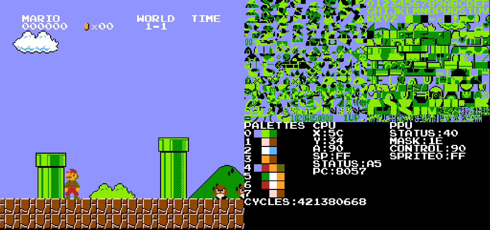

# Nes Emulator
Nintendo Entertainment System emulator implementation in C++ 



# Progress
- [x] CPU
- [x] Background rendering
- [x] Sprite rendering
- [ ] Keyboard input
    - [x] NES Controller 1
    - [ ] NES Controller 2
- [ ] Audio
    - [x] Pulse1 Channel
    - [x] Pulse2 Channel
    - [x] Noise Channel
    - [ ] Triangle Channel
    - [ ] DMC
- [ ] Mappers
    - [x] Mapper000
    - [x] Mapper001
    - [x] Mapper002
    - [x] Mapper003
    - [x] Mapper066

# Generating project
```
git clone https://github.com/GeFeC/nes-emulator.git
cd nes-emulator
mkdir build
cd build
cmake .. -G "<GENERATOR>" -DCMAKE_BUILD_TYPE=Release
```
If you are using GNU Make to build the project:
```
make -j4
```
# Usage
```
./nes-emulator rom_name_without_extension
```
